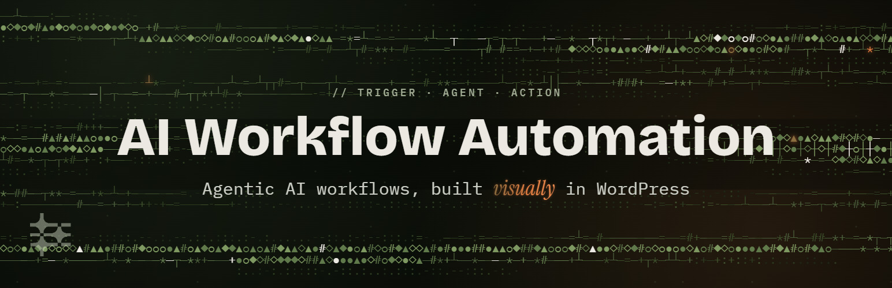
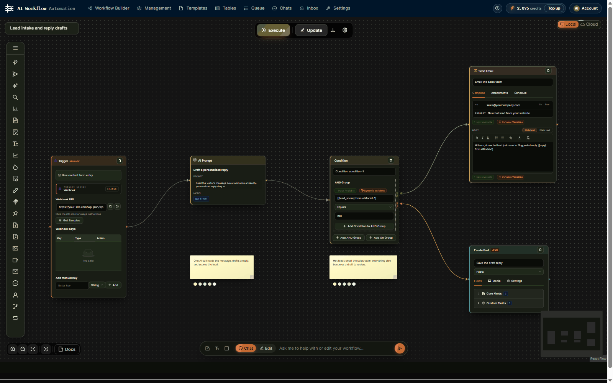
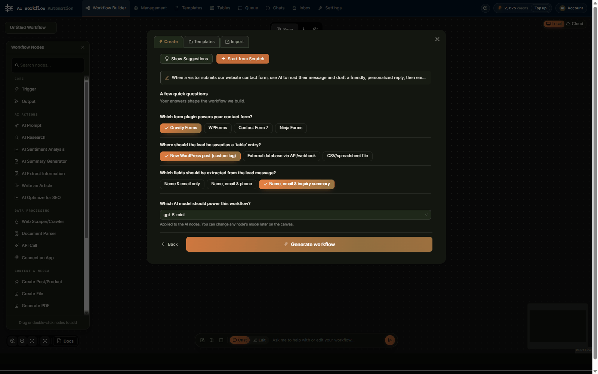
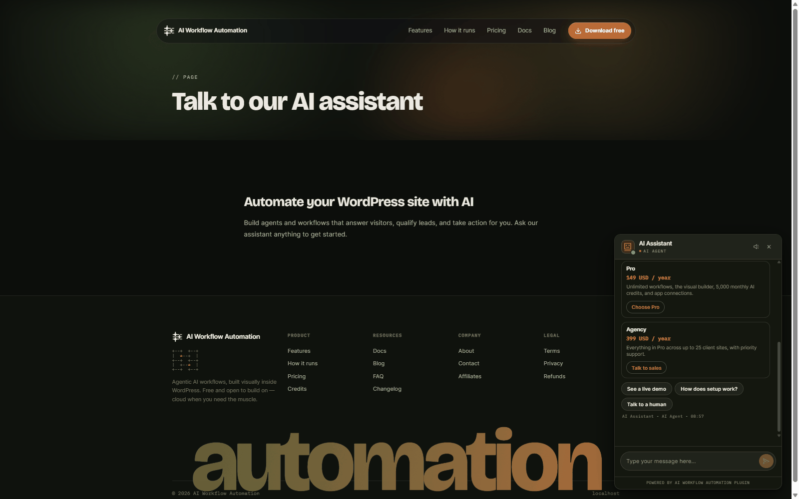
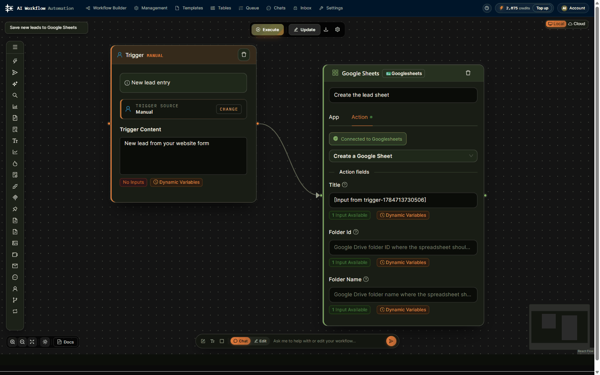
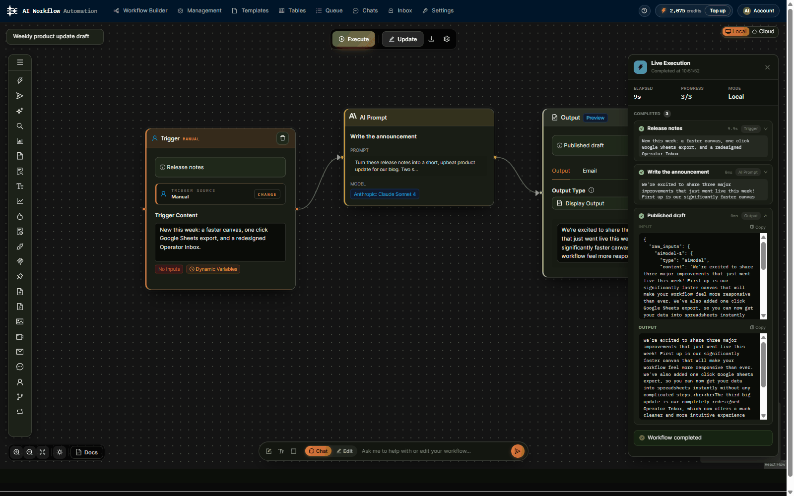
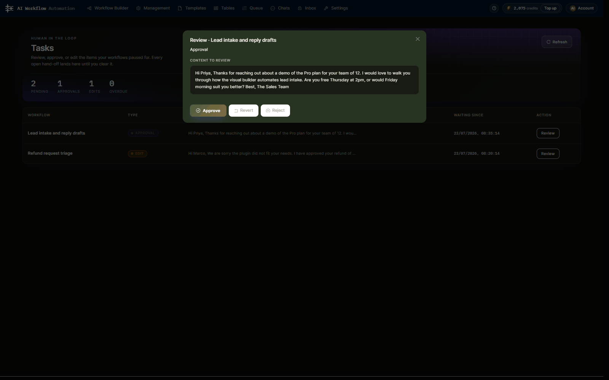

# AI Workflow Automation for WordPress

Build AI agents, chatbots and multi-step content workflows inside wp-admin with a visual, drag-and-drop builder. Free with your own API key (OpenAI, Anthropic, OpenRouter), or run workflows on the optional hosted cloud engine.

> **This is a read-only mirror of the wordpress.org release.** Each tag (`v2.0.7`, `v2.0.8`, ...) is the exact content of the plugin zip published on wordpress.org for that version. Issues are welcome here. Pull requests are not merged in this repository: development happens in the main project, so open an issue (a patch or a PR for discussion is fine) and we carry accepted changes into the next release.

## Install

Install from the WordPress plugin directory: **[wordpress.org/plugins/ai-workflow-automation-lite](https://wordpress.org/plugins/ai-workflow-automation-lite/)**, or in wp-admin go to *Plugins > Add New* and search for "AI Workflow Automation".

Requires WordPress 6.2+ and PHP 8.0+. The agent features below need WordPress 7.0.

## What it does

- **Visual workflow builder**: chain triggers, AI steps, logic and actions on a canvas, then watch each run live with per-node input and output.
- **AI models**: OpenAI, Anthropic (Claude) and OpenRouter, with typed multi-output fields that flow into later steps.
- **Triggers**: manual, scheduled, webhooks, WordPress events, and Gravity Forms, WPForms, Contact Form 7, Ninja Forms and Elementor Forms submissions.
- **Actions**: create or update posts and custom post types (WooCommerce, ACF), send email, call APIs, write to database tables, generate PDFs and images, connect Google, Slack, Notion, GitHub and more.
- **AI chat agents**: a front-end chatbot that searches your content, calls workflows as tools, asks for approval before sensitive actions, and hands off to Chatwoot, Zendesk or Intercom.
- **Human in the loop**: pause any workflow for review, edits or approval.
- **Knowledge base (RAG)**, research and Firecrawl scraping, parsers, loops and conditions, and an MCP client node.

## For AI agents: Abilities API and MCP Adapter

On WordPress 7.0 the plugin can expose your workflows to AI agents through the core **Abilities API** and the official **[WordPress MCP Adapter](https://github.com/WordPress/mcp-adapter)**. It is opt-in and off by default (Settings > AI Agents (MCP) > "Expose workflows to AI agents").

When enabled:

- An ability category `wp-ai-workflows` is registered with a discovery ability, `wp-ai-workflows/list-workflows`.
- Every active workflow with a manual or webhook trigger becomes a runnable ability, `wp-ai-workflows/run-<workflow-id>`, with a JSON input schema derived from its trigger and structured output (up to 100 workflows).
- If the MCP Adapter plugin is active, an MCP server `wp-ai-workflows` is registered over the adapter's HTTP transport at `/wp-json/wp-ai-workflows/mcp`, publishing those abilities as MCP tools.
- Calls require the `manage_options` capability by default (filterable with `wp_ai_workflows_abilities_capability`), with per-workflow spend controls.

So any MCP client that can reach your site (Claude, Cursor, ChatGPT and others via the adapter) can list and run your WordPress workflows as tools.

## Screenshots

| | |
|---|---|
|  Visual workflow builder |  Interactive AI workflow generator |
|  AI agent chat on your site |  Connect an App |
|  Live execution view |  Human in the loop |

## Local or Cloud

- **Local (free, bring your own key)**: the builder, triggers, nodes, chat widget and local execution run on your server. AI calls go straight from your site to your provider. No account, nothing sent to us.
- **Cloud (optional)**: connect a free account to run workflows on the hosted engine with keyless AI, server-side scheduling and no PHP timeouts. See the *External services* section of [readme.txt](readme.txt) for exactly what is sent and when.

## Links

- Website: [wpaiworkflowautomation.com](https://wpaiworkflowautomation.com)
- Documentation: [wpaiworkflowautomation.com/docs](https://wpaiworkflowautomation.com/docs/)
- wordpress.org listing: [ai-workflow-automation-lite](https://wordpress.org/plugins/ai-workflow-automation-lite/)
- Support forum: [wordpress.org/support/plugin/ai-workflow-automation-lite](https://wordpress.org/support/plugin/ai-workflow-automation-lite/)
- Changelog: the `== Changelog ==` section of [readme.txt](readme.txt)

## Licence

GPL-2.0-or-later. See [LICENSE](LICENSE).
